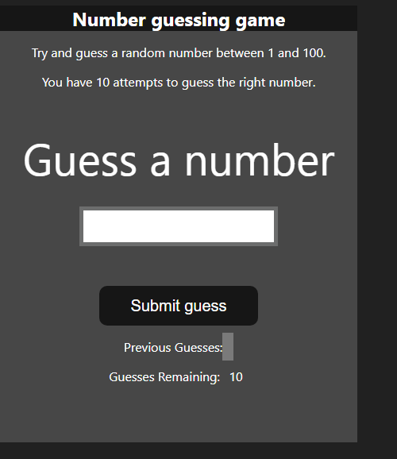
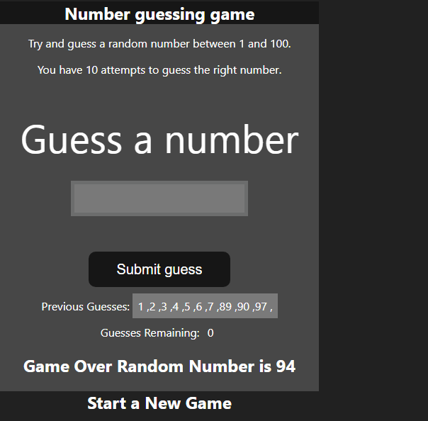

# 🎯 Guess the Number Game

A simple and fun "Guess the Number" game built with **HTML**, **CSS**, and **JavaScript**. Try to guess the secret number within a limited number of attempts!

## 🔍 Live Demo

[Play it here](https://guessnumber-abhay-004.netlify.app/)  

---

## 📷 Screenshot

  
  

---

## 🕹️ How to Play

- A random number between 1 and 100 is generated.
- You have a limited number of tries to guess the number.
- After each guess, you'll get a hint:
  - 📉 Too low
  - 📈 Too high
  - ✅ Correct!

---

## 🚀 Features

- Interactive UI with real-time feedback
- Simple and clean design
- Fully responsive layout
- Option to restart the game

---

## 🧑‍💻 Technologies Used

- HTML5
- CSS3
- JavaScript (Vanilla)
